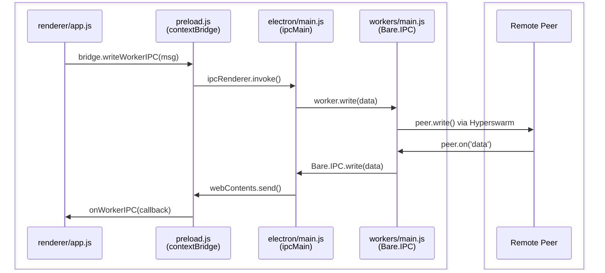

# Exercise 2 - Making Chat App

The renderer runs in a sandboxed web page — it can't use Node APIs directly. Bare is an embedded JS runtime that runs alongside the app. It's the same runtime used on mobile, so P2P code written here works across platforms.

The pattern: P2P logic lives in a Bare worker, the renderer talks to it via electron main process. 

Since Bare runs on Mobile as well as Desktop, keeping P2P logic in a discrete Bare runtime allows for seamless local "backend" logic re-use for Mobile.



## Dependencies

```sh
npm install hyperswarm hypercore-crypto b4a
```

## Worker

Create `workers/main.js`:

```js
const Hyperswarm = require('hyperswarm')
const crypto = require('hypercore-crypto')
const b4a = require('b4a')

const swarm = new Hyperswarm()

function send(msg) {
  Bare.IPC.write(Buffer.from(JSON.stringify(msg)))
}

Bare.IPC.on('data', (data) => {
  const msg = JSON.parse(data.toString())
  if (msg.type === 'create') joinSwarm(crypto.randomBytes(32))
  else if (msg.type === 'join') joinSwarm(b4a.from(msg.topic, 'hex'))
  else if (msg.type === 'message') {
    for (const peer of swarm.connections) peer.write(msg.text)
  }
})

swarm.on('connection', (peer) => {
  const name = b4a.toString(peer.remotePublicKey, 'hex').slice(0, 6)
  peer.on('data', (data) => send({ type: 'message', from: name, text: data.toString() }))
  peer.on('error', console.error)
})

swarm.on('update', () => {
  send({ type: 'peers', count: swarm.connections.size })
})

async function joinSwarm(topicBuffer) {
  const discovery = swarm.join(topicBuffer, { client: true, server: true })
  await discovery.flushed()
  send({ type: 'joined', topic: b4a.toString(topicBuffer, 'hex') })
}
```

## HTML

Replace `renderer/index.html` with:

```html
<!doctype html>
<html>
  <head>
    <style>
      #titlebar {
        -webkit-app-region: drag;
        height: 30px;
        width: 100%;
        position: fixed;
        left: 0;
        top: 0;
        background-color: #b0d94413;
        filter: drop-shadow(2px 10px 6px #888);
      }

      button, input {
        all: unset;
        border: 1px ridge #b0d944;
        background: #000;
        color: #b0d944;
        padding: .45rem;
        font-family: monospace;
        font-size: 1rem;
        line-height: 1rem;
      }

      body {
        background-color: #001601;
        font-family: monospace;
        margin: 0;
        padding: 0;
      }

      main {
        display: flex;
        height: 100vh;
        color: white;
        justify-content: center;
        margin: 0;
        padding: 0;
      }

      .hidden { display: none !important; }

      #or { margin: 1.5rem auto; }

      #setup {
        display: flex;
        flex-direction: column;
        align-items: center;
        justify-content: center;
      }

      #loading { align-self: center; }

      #chat {
        display: flex;
        flex-direction: column;
        width: 100vw;
        padding: .75rem;
      }

      #header {
        margin-top: 2.2rem;
        margin-bottom: 0.75rem;
      }

      #details {
        display: flex;
        justify-content: space-between;
      }

      #messages {
        flex: 1;
        font-family: 'Courier New', Courier, monospace;
        overflow-y: scroll;
      }

      #message-form { display: flex; }
      #message { flex: 1; }
    </style>
    <script type="module" src="./app.js"></script>
  </head>
  <body>
    <div id="titlebar"></div>
    <main>
      <div id="setup">
        <div><button id="create-chat-room">Create</button></div>
        <div id="or">- or -</div>
        <form id="join-form">
          <button type="submit">Join</button>
          <input required id="join-chat-room-topic" type="text" placeholder="Chat Room Topic" />
        </form>
      </div>
      <div id="loading" class="hidden">Loading ...</div>
      <div id="chat" class="hidden">
        <div id="header">
          <div id="details">
            <div>Topic: <span id="chat-room-topic"></span></div>
            <div>Peers: <span id="peers-count">0</span></div>
          </div>
        </div>
        <div id="messages"></div>
        <form id="message-form">
          <input id="message" type="text" />
          <input type="submit" value="Send" />
        </form>
      </div>
    </main>
  </body>
</html>
```

## JavaScript

Replace `renderer/app.js` with:

```js
const bridge = window.bridge
const decoder = new TextDecoder('utf-8')
const encoder = new TextEncoder()

const WORKER = '/workers/main.js'

function sendToWorker(msg) {
  bridge.writeWorkerIPC(WORKER, encoder.encode(JSON.stringify(msg)))
}

bridge.startWorker(WORKER)

bridge.onWorkerIPC(WORKER, (data) => {
  const msg = JSON.parse(decoder.decode(data))
  if (msg.type === 'joined') {
    document.querySelector('#chat-room-topic').innerText = msg.topic
    document.querySelector('#loading').classList.add('hidden')
    document.querySelector('#chat').classList.remove('hidden')
  } else if (msg.type === 'peers') {
    document.querySelector('#peers-count').textContent = msg.count
  } else if (msg.type === 'message') {
    onMessageAdded(msg.from, msg.text)
  }
})

document.querySelector('#create-chat-room').addEventListener('click', () => {
  document.querySelector('#setup').classList.add('hidden')
  document.querySelector('#loading').classList.remove('hidden')
  sendToWorker({ type: 'create' })
})

document.querySelector('#join-form').addEventListener('submit', (e) => {
  e.preventDefault()
  const topic = document.querySelector('#join-chat-room-topic').value
  document.querySelector('#setup').classList.add('hidden')
  document.querySelector('#loading').classList.remove('hidden')
  sendToWorker({ type: 'join', topic })
})

document.querySelector('#message-form').addEventListener('submit', (e) => {
  e.preventDefault()
  const text = document.querySelector('#message').value
  document.querySelector('#message').value = ''
  onMessageAdded('You', text)
  sendToWorker({ type: 'message', text })
})

function onMessageAdded(from, text) {
  const div = document.createElement('div')
  div.textContent = `<${from}> ${text}`
  document.querySelector('#messages').appendChild(div)
}
```

## Check

```sh
npm start
```

Create a room, copy the topic, then open a second instance with separate storage:

```sh
npm start -- --storage /tmp/chat-2
```

Join with the topic in the second window. Messages should flow between them.
