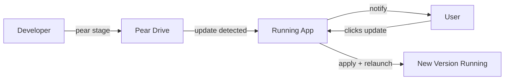

# Exercise 5 - Updating Deployment

Make a change to the app, deploy it, and watch running instances update themselves.

## Make a Change

Edit something visible — for example, change the `Create` button label in `renderer/index.html` to say `Create Game`:

```html
<button id="create-game">Create Game</button>
```

## Deploy the Update

To perform an update we must

* make sure the application is seeded with `pear seed pear://...`
* bump the `package.json` `version`
* make the distributables
* rebuild the deployment folder
* stage the deployment folder

Then the update will be received by other applications.

Make sure that the application is open your machine so you can see the update land.

Bump the version:

```sh
git add . && git commit -m 'workshop'
npm version patch
```

Make:

```sh
npm run make
```

Rebuild deployment:

```sh
pear-build --darwin-arm64-app "./out/Chat-darwin-arm64/Chat.app" ./out/build
```

Replace and `--darwin-arm64-app` with the flag for the OS arch the commands are running on.

Stage the deployment:

```
pear stage pear://<your-link> ./out/build
```

## Watch It Land

Any running instance connected to the seeded drive will detect the update. The app checks on startup and while running.

The `pear-runtime` module joins a Hyperswarm topic derived from the staged drive's discovery key, replicating the `hyperdrive` peer-to-peer via `corestore`. The `pear-runtime-updater` updater listens for append events on the drive's `hypercore` — every `pear stage`, `pear provision`,`pear multisig` leads to appends to the drive. On each append it checks /`package.json` on the drive; if the version differs from the running version, it emits an `updating` event mirrors the platform-specific app bundle (/by-arch/<platform>-<arch>/app/<name>) to a temporary next directory, then emits `updated`.

When the user confirms, `applyUpdate()` is called, which swaps the app binary in-place (macOS/Linux via `fsx.swap`) or installs via `msix-manager` (Windows).



