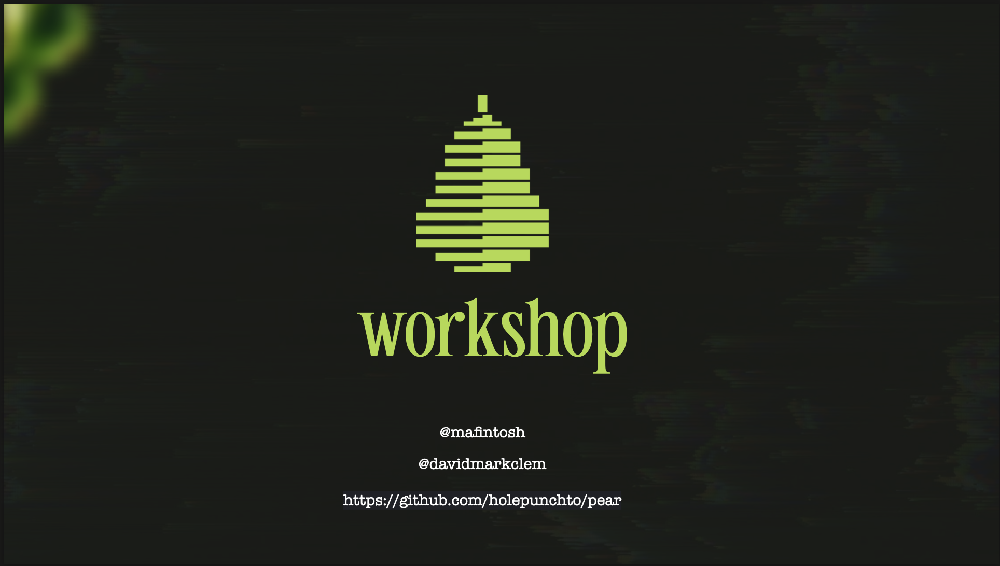

# pear-workshop

Welcome to the [Pear Runtime](https://github.com/holepunchto/pear) Workshop.


https://keet.io




## Requirements

* `npm` is used to install project dependencies so Node.js with `npm` is required

## Setup

### With Node

Pear is not built on Node. It's just easy to use Node to bootstrap Pear if Node is already installed.

If Node & npm are installed Pear can be bootstrapped on the command-line with:

```sh
npx pear
```

Once installed run `npx pear run pear://runtime`. This will open a new window that shows Complete Pear Setup. Click it. Setup complete. Open a new terminal and run `pear`. Pear help should be output.

### Without Node

Installing any Pear app installs Pear, to install Pear install Desktop Keet from https://keet.io

Then it's just a matter of exposing the `pear` bin in the system PATH. The path to the bin is different per OS.

#### MacOS

Make sure Keet is installed first: https://keet.io

```
echo 'export PATH="$HOME/Library/Application Support/pear/bin:$PATH"' >> ~/.zshrc
source ~/.zshrc
pear
```

#### Linux

Make sure Keet is installed first: https://keet.io

```
echo 'export PATH="$HOME/.config/pear/bin:$PATH"' >> ~/.bashrc
source ~/.bashrc
pear
```

#### Windows

Make sure Keet is installed first: https://keet.io

##### cmd.exe

```
setx PATH "%USERPROFILE%\AppData\Roaming\Pear\bin;%PATH%"
```

**THEN START A NEW CMD.EXE FOR THE CHANGE TO TAKE EFFECT**

##### Powershell

```
[Environment]::SetEnvironmentVariable(
  "Path",
  "$env:USERPROFILE\AppData\Romaing\pear\bin;$([Environment]::GetEnvironmentVariable('Path','User'))",
  "User"
)
```

**THEN START A NEW POWERSHELL FOR THE CHANGE TO TAKE EFFECT**

## Outline

* Setup
* Pear Preamble - What is Pear?
* [Exercise 01-pear-init](exercises/01-pear-init/readme.md)
* [Exercise 02-pear-run](exercises/02-pear-run/readme.md)
* [Exercise 03-make-chat-app](exercises/03-make-chat-app/readme.md)
* [Exercise 04-pear-stage](exercises/04-pear-stage/readme.md)
* [Exercise 05-pear-seed](exercises/05-pear-seed/readme.md)
* [Exercise 06-connecting-peers](exercises/06-connecting-peers/readme.md)
* Let's Make Snake
* Wrapup

# Pear Runtime Documentation

Pear Runtime Documentation can be found at https://docs.pears.com or pear://runtime/documentation.