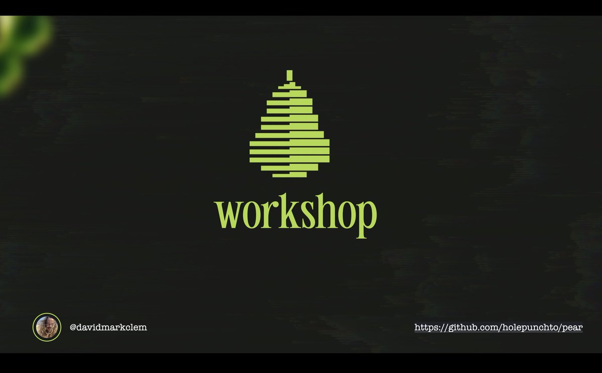

# pear-workshop

Welcome to the [Pear Runtime](https://github.com/holepunchto/pear) Workshop.



## Requirements

* `npm` is used to install project dependencies so Node.js with `npm` is required

## Setup

It's either a one line command or a button click in [Keet](https://keet.io) Profile & Settings.

There are two ways to bootstrap Pear.

### OPTION 1: Bootstrap Pear with Node.js

Pear is not built on Node. It's just easy to use Node to bootstrap Pear if Node is already installed.

If Node & npm are installed Pear can be bootstrapped on the command-line with:

```sh
npx pear
```

Once installed run `pear run pear://runtime`. This will open a new window that shows Complete Pear Setup. Click it. Setup complete. Open a new terminal and run `pear`. Pear help should be output. 

### OPTION 2: Bootstrap Pear with Keet

The second way to bootstrap Pear is to install Keet from https://keet.io. Keet is a Pear Application for video chat, broadcast feeds and more, all peer-to-peer on both Desktop and Mobile. 

Open Keet and click the Profile Picture in the top right to open Profile & Settings. Scroll and click "Build on Pear Runtime" button.  This will open a new window that shows Complete Pear Setup. Click it. Setup complete. Open a new terminal and run `pear`. Pear help should be output.

## Outline

* Setup
* Pear Preamble - What is Pear?
* [Exercise 01-pear-init](exercises/01-pear-init/readme.md)
* [Exercise 02-pear-run](exercises/02-pear-run/readme.md)
* [Exercise 03-making-the-app](exercises/03-making-the-app/readme.md)
* Pear Perusal - Building Blocks
* [Exercise 04-pear-stage](exercises/04-pear-stage/readme.md)
* [Exercise 05-pear-seed](exercises/05-pear-seed/readme.md)
* [Exercise 06-connecting-peers](exercises/06-connecting-peers/readme.md)
* [Exercise 07-pear-release](exercises/07-pear-release/readme.md)
* Pear Updates API & Filesystems/Hyperdrives
* Building Application Distributables
* Peer-to-Peer Identity & Authoring
* Pear Worker API & Pear Desktop/Terminal/Mobile Applications
* Wrapup

# Pear Runtime Documentation

Pear Runtime Documentation can be found at https://docs.pears.com or [pear://runtime/documentation](pear://runtime/documentation).